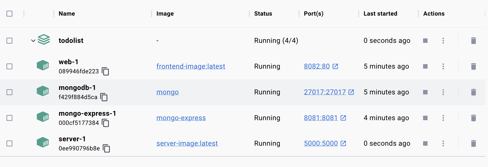

## 全网基于 TS + React + AntD + Koa2 + MongoDB + swagger在线文档生成 + Docker一键部署运行的最佳TodoList 全栈MVP应用

**克隆本项目后直接运行build_images.sh脚本自动进行镜像构建和容器启动，这里特别注意server端如果是Mac本地和mongodb连接用mongodb://127.0.0.1:27017/todo，如果是Docker容器内部连接用mongodb://mongodb:27017/todo,swagger本地访问地址：http://localhost:5000/api/swagger-html**
